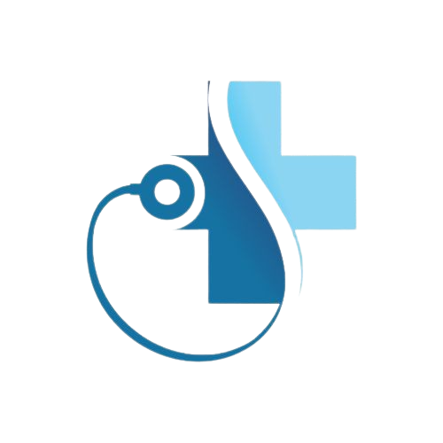

# Wound Detection System



## Overview
The Wound Detection System is a mobile application developed using Flutter and Dart, designed to help medical professionals and patients quickly classify wounds. It uses Azure Custom Vision AI to analyze images taken from the camera or uploaded from the gallery and identifies them into one of four wound categories. This tool aims to enhance the accuracy and efficiency of wound assessments in clinical and remote settings.

## Features
- **Camera Integration**: Capture images directly through the device's camera.
- **Gallery Upload**: Ability to choose and upload images from the device's gallery.
- **Wound Classification**: Utilizes a trained machine learning model on Azure Custom Vision AI to classify wounds into four types.
- **User-Friendly Interface**: Simple and intuitive user interface that makes it easy for both medical professionals and patients to use.

## Technology Stack
 **Flutter**  
 **Dart**  
 **Azure Custom Vision AI**  
 **Firebase**  
 **Azure**

## Prerequisites
Before you begin, ensure you have the following:
- Flutter (Channel stable, latest version)
- Dart (latest version)
- An Azure account with Custom Vision AI set up

## Installation
1. **Clone the Repository:**
   ```bash
   git clone https://github.com/oreo925/wound_detection_system.git
   cd wound-detection-system
   ```

2. **Install Dependencies:**
   ```bash
   flutter pub get
   ```

3. **Set up Azure Custom Vision AI:**
   - Navigate to the Azure portal and set up a new Custom Vision project.
   - Train your model with labeled images of the four wound types.
   - Obtain the prediction key and endpoint URL for your trained model.

4. **Configure the App:**
   - Open the `lib/config.dart` file.
   - Replace the placeholder values with your Azure Custom Vision keys and endpoint URL.

5. **Run the App:**
   ```bash
   flutter run
   ```

## Usage
- **To Classify a Wound:**
  1. Open the app on your device.
  2. Choose to take a picture with the camera or select an image from the gallery.
  3. The image will be automatically sent to Azure Custom Vision AI for classification.
  4. The classification results will be displayed on the screen.

## License
This project is licensed under the MIT License - see the [LICENSE.md](LICENSE) file for details.

## Acknowledgements
- Azure Custom Vision AI
- Flutter Community
- Firebase 
- All contributors who helped in building this app
